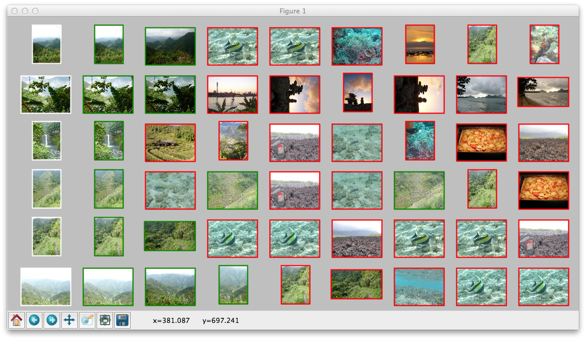
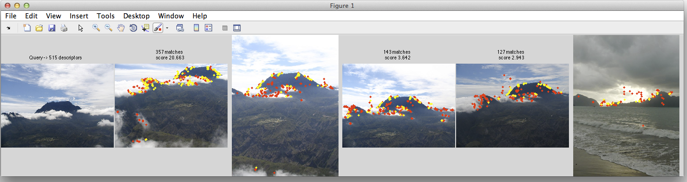

Image indexing example
----------------------

Here we work out two simple image indexing engines use them to processe a tiny image
dataset. The first is done in python and implements a description based
on Fisher vectors, while the second is in Matlab and shows how to use an
inverted file with binary signatures.

We are going to work on the 100 first query images of the
`Holidays <http://lear.inrialpes.fr/~jegou/data.php#holidays>`_ dataset,
and their associated database examples. Download
the images and the SIFT descriptors from here:

http://pascal.inrialpes.fr/data2/douze/holidays_subset/images.tgz

http://pascal.inrialpes.fr/data2/douze/holidays_subset/sifts.tgz

Unzip them to a ``holidays_100`` subdirectory. Note that the images
were resized and the number of extracted SIFT descriptors per image
was limited to make a quick demo.

The indexing methods are fully functional. You can reproduce them on
your images, see the "Descriptor Extraction" section in the Holidays
homepage to process them.

Image indexing in Python with Fisher vectors
++++++++++++++++++++++++++++++++++++++++++++

Image indexing based on Fisher vectors consists in computing a global
Fisher vector (FV) for each image, using the local SIFTs from these
images. The L2 distance between FVs is a good approximation of
the similarity of the contents of the images. See
`Aggregating local image descriptors into compact codes <https://hal.inria.fr/inria-00633013>`_
for more details. You may also be interested in
`INRIA's Fisher vector implementation <http://lear.inrialpes.fr/src/inria_fisher/>`_
which is a Matlab version of this example, on the complete Holidays dataset.

The FV computation relies on a training where a Gaussian Mixture Model
(GMM) is fitted to a set of representative local descriptors. For
simplicity, we are going to use the descriptors of the database we
index.

In the following, you can just copy/paste the code to the Python
interpreter (or put it in a script). You can inspect the variables,
which are plain numpy arrays, load/save them to files, etc.

We first load all the descriptors

.. code-block:: python

   import os
   import numpy as np
   from yael import ynumpy

   # list of available images
   image_names = [filename.split('.')[0]
                  for filename in os.listdir('holidays_100')
                  if filename.endswith('.jpg')]

   # load the SIFTs for these images
   image_descs = []
   for imname in image_names:
       desc, meta = ynumpy.siftgeo_read("holidays_100/%s.siftgeo" % imname)
       if desc.size == 0: desc = np.zeros((0, 128), dtype = 'uint8')
       # we drop the meta-information (point coordinates, orientation, etc.)
       image_descs.append(desc)

Next we sample the descriptors to reduce their dimensionality by
PCA and computing a GMM. For a GMM of size k (let's set it to 64), we
need about 1000*k training descriptors

.. code-block:: python

   # make a big matrix with all image descriptors
   all_desc = np.vstack(image_descs)

   k = 64
   n_sample = k * 1000

   # choose n_sample descriptors at random
   sample_indices = np.random.choice(all_desc.shape[0], n_sample)
   sample = all_desc[sample_indices]

   # until now sample was in uint8. Convert to float32
   sample = sample.astype('float32')

   # compute mean and covariance matrix for the PCA
   mean = sample.mean(axis = 0)
   sample = sample - mean
   cov = np.dot(sample.T, sample)

   # compute PCA matrix and keep only 64 dimensions
   eigvals, eigvecs = np.linalg.eig(cov)
   perm = eigvals.argsort()                   # sort by increasing eigenvalue
   pca_transform = eigvecs[:, perm[64:128]]   # eigenvectors for the 64 last eigenvalues

   # transform sample with PCA (note that numpy imposes line-vectors,
   # so we right-multiply the vectors)
   sample = np.dot(sample, pca_transform)

   # train GMM
   gmm = ynumpy.gmm_learn(sample, k)

The gmm is a tuple containing the a-priori weights per mixture
component, the mixture centres and the diagonal of the component
covariance matrices (the model assumes a diagonal matrix, otherwise
the descriptor would be way too long).

The training is finished. The next stage is to encode the SIFTs into
one vector per image. We choose to include only the derivatives w.r.t.
mu in the FV, which results in a FV of size k * 64.

.. code-block:: python

   image_fvs = []
   for image_desc in image_descs:
      # apply the PCA to the image descriptor
      image_desc = np.dot(image_desc - mean, pca_transform)
      # compute the Fisher vector, using only the derivative w.r.t mu
      fv = ynumpy.fisher(gmm, image_desc, include = 'mu')
      image_fvs.append(fv)

   # make one matrix with all FVs
   image_fvs = np.vstack(image_fvs)

   # normalizations are done on all descriptors at once

   # power-normalization
   image_fvs = np.sign(image_fvs) * np.abs(image_fvs) ** 0.5

   # L2 normalize
   norms = np.sqrt(np.sum(image_fvs ** 2, 1))
   image_fvs /= norms.reshape(-1, 1)

   # handle images with 0 local descriptor (100 = far away from "normal" images)
   image_fvs[np.isnan(image_fvs)] = 100

Now the FV can be used to compare images, so we compute for each Holidays
query image the nearest images in the ``image_fvs`` matrix.

.. code-block:: python

   # get the indices of the query images (the subset of images that end in "00")
   query_imnos = [i for i, name in enumerate(image_names) if name[-2:] == "00"]

   # corresponding descriptors
   query_fvs = image_fvs[query_imnos]

   # get the 8 NNs for all query images in the image_fvs array
   results, distances = ynumpy.knn(query_fvs, image_fvs, nnn = 8)

The mAP performance for this search can be computed as:

.. code-block:: python

   aps = []
   for qimno, qres in zip(query_imnos, results):
       qname = image_names[qimno]
       # collect the positive results in the dataset
       # the positives have the same prefix as the query image
       positive_results = set([i for i, name in enumerate(image_names)
                               if name != qname and name[:4] == qname[:4]])
       #
       # ranks of positives. We skip the result #0, assumed to be the query image
       ranks = [i for i, res in enumerate(qres[1:]) if res in positive_results]
       #
       # accumulate trapezoids with this basis
       recall_step = 1.0 / len(positive_results)
       ap = 0
       for ntp,rank in enumerate(ranks):
          # ntp = nb of true positives so far
          # rank = nb of retrieved items so far
          # y-size on left side of trapezoid:
	  precision_0 = ntp/float(rank) if rank > 0 else 1.0
          # y-size on right side of trapezoid:
          precision_1 = (ntp + 1) / float(rank + 1)
          ap += (precision_1 + precision_0) * recall_step / 2.0
       print "query %s, AP = %.3f" % (qname, ap)
       aps.append(ap)

    print "mean AP = %.3f" % np.mean(aps)

Now we display the search results for a few query images. There is one
line per query image, which shows the image, and a row of retrieval
results. The correct results have a green rectangle around them,
negative ones a red rectangle. Most code is just matplotlib commands
to adjust the image layout.

.. code-block:: python

   from matplotlib import pyplot
   from matplotlib.image import imread

   nrow = 6   # number of query images to show
   nres = 8   # number of results per query

   def show_image(imno, frame_color):
       im = imread("holidays_100/%s.jpg" % image_names[imno])
       pyplot.imshow(im)
       h, w = im.shape[:2]
       pyplot.plot([0, 0, w, w, 0], [0, h, h, 0, 0], frame_color, linewidth = 2)
       pyplot.axis('off')

   # reduce the margins
   pyplot.subplots_adjust(wspace = 0, hspace = 0,
                          top = 0.99, bottom = 0.01, left = 0.01, right = 0.99)

   no = 1  # index current of subfigure
   for qno in range(nrow):
       pyplot.subplot(nrow, nres + 1, no); no += 1
       # show query image with white outline
       qimno = query_imnos[qno]
       show_image(qimno, 'w')
       for qres in results[qno, :nres]:
           pyplot.subplot(nrow, nres + 1, no); no += 1
           # use image name to determine if it is a TP or FP result
	   is_ok = image_names[qres][:4] == image_names[qimno][:4]
    	   show_image(qres, 'g' if is_ok else 'r')

   pyplot.show()

This part requires matplotlib to be installed, which can be done via
macports on the Mac and your usual package installation tool on
Linux. The output looks like:

Note that the query image always appears as the first retrieval
result, because it is included in the dataset.

Image indexing in Matlab with inverted files
++++++++++++++++++++++++++++++++++++++++++++

In the example below, we show how to use an inverted file of Yael from Matlab.
More specifically, the inverted file we consider supports the use of binary
signatures, as proposed in the Hamming Embedding approach described in
`this paper <http://dx.doi.org/10.1007/978-3-540-88682-2_24>`_.

This example is simplified for the sake of exposure. It does not implements
some ingredients of the original approach, as multiple assignment, IDF terms.
The user interested in a more complete system should instead download the `dedicated package
<https://gforge.inria.fr/frs/download.php/33244/selective_match_kernel_v289.tar.gz>`_,
which implements the AMSK state-of-the art approach described in the paper:
`To aggregate or not to aggregate: selective match kernels for image search
<http://dx.doi.org/10.1109/ICCV.2013.177>`_.

Before launching the code, please ensure that

- You have a working and compiled version of Yael's matlab interface
- The corresponding directory ('YAELDIR/matlab') is in your matlab Path.
  If not, use the addpath('YAELDIR/matlab') to add it.

To start with, we define the parameters of the indexing method. Here, we
choose a vocabulary of size k=1024. This is less than what you should use in
practice (e.g., k=100k). We also set some parameters specific to Hamming embedding.

.. code-block:: matlab

  k = 1024;                            % Vocabulary size
  dir_data = './holidays_100/';        % data directory

  % Parameters For Hamming Embedding
  nbits = 128;                         % Typical values are 32, 64 or 128 bits
  ht = floor(nbits*24/64);             % Hamming Embedding threshold
  scoremap = zeros (1, nbits+1);       % How we map Hamming distances to scores
  scoremap(1:ht+1) = (1-(0:ht)/ht).^3;

Hereafter, we show how we typically load a set of images and descriptors
stored in separate files. We use the standard matlab functions ``arrayfun`` and ``cellfun``
to perform operations in batch. The descriptors are assumed stored
in the siftgeo format, therefore we read them with the yael 'siftgeo_read' function.

.. code-block:: matlab

  %---------------------------------------------------------------
  % Retrieve the image list and load the images and SIFT
  %---------------------------------------------------------------

  img_list = dir ([dir_data '/*.jpg']);
  nimg = numel(img_list); tic

  imgs = arrayfun (@(x) (imread([dir_data x.name])), img_list, 'UniformOutput', false) ;
  fprintf ('* Loaded %d images in %.3f seconds\n', numel(imgs), toc); tic

  [sifts, meta] = arrayfun (@(x) (siftgeo_read([dir_data strrep(x.name, '.jpg', '.siftgeo')])), ...
                                  img_list, 'UniformOutput', false) ;
  nsifts = cellfun(@(x)(size(x,2)),sifts);
  totsifts = sum(nsifts);

  fprintf ('* Loaded %d descriptors in %.3f seconds\n', totsifts, toc); tic

  sifts = cellfun (@(x) (yael_vecs_normalize(sign(x).*sqrt(abs(x)))), sifts, 'UniformOutput', false) ;

  fprintf ('* Convert to RootSIFT in %.3f seconds\n', toc);

This should produce an output like this::

  * Loaded 274 images in 2.408 seconds
  * Loaded 286421 descriptors in 0.126 seconds
  * Convert to RootSIFT in 0.311 seconds

Now, we are going to learn the visual vocabulary with k-means and subsequently
construct the inverted file structure for Hamming Embedding.
We learn it on Holidays itself to avoid requiring another dataset.
But note that this should be avoided for a true system,
and a proper evaluation should employ an external dataset for dictionary learning.

.. code-block:: matlab

  %---------------------------------------------------------------
  % Learn and build the image indexing structure
  %---------------------------------------------------------------

  vtrain = [sifts{:}];
  vtrain = vtrain (:, 1:2:end); tic

  C = yael_kmeans (vtrain, k, 'niter', 10);
  fprintf ('* Learned a visual vocabulary C in %.3f seconds\n', toc); tic

  % We provide the codebook and the function that performs the assignment,
  % here it is the exact nearest neighbor function yael_nn

  ivfhe = yael_ivf_he (k, nbits, vtrain, @yael_nn, C);
  fprintf ('* Learned the Hamming Embedding structure in %.3f seconds\n', toc); tic

The output should resemble what follows::

  Input: 143211 vectors of dimension 128
  k=1024 niter=10 redo=1 verbose=1 seed=0 v1=[0.0672166 0.0672166 ...], v2=[0.0473059 0.0473059... ]
  * Learned a visual vocabulary C in 7.771 seconds
  * Learned the Hamming Embedding structure in 1.440 seconds

We can add the descriptors of all the database images to the inverted file.
Here, Each local descriptor receives an identifier. This is not a requirement:
another possible choice would be to use directly the id of the image. But in this
case we could not use this output for spatial verification. In our case, the
descriptor id will be used to display the matches.

We also compute a normalization factor and store it in ``imnorms``. It corresponds
to the L2-norm of the corresponding bag-of-words vector.

.. code-block:: matlab

  imnorms = zeros (nimg, 1);              % Score normalization per image
  descid_to_imgid = zeros (totsifts, 1);  % desc to image conversion
  imgid_to_descid = zeros (nimg, 1);      % for finding desc id
  t0 = cputime;
  lastid = 0;

  for i = 1:nimg
    ndes = nsifts(i);  % number of descriptors

    % Add the descriptors to the inverted file.
    % The function returns the visual words (and binary signatures),
    [vw,bits] = ivfhe.add (ivfhe, lastid+(1:ndes), sifts{i});
    imnorms(i) = norm(hist(vw,1:k));

    descid_to_imgid(lastid+(1:ndes)) = i;
    imgid_to_descid(i) = lastid;
    lastid = lastid + ndes;
  end
  fprintf ('* Quantization, bitvectors computed and added to IVF in %.3fs\n',  cputime-t0);

Typical output::

  * Quantization, bitvectors computed and added to IVF in 9.660s

Finally, we make some queries. We compute two measures

- the number of matches ``n_immatches`` between query and database images
- a normalized score ``n_imscores`` that takes into account the strength of the matches

For the second, we invoke the standard Matlab function ``accumarray``, which in
essence compute here a histogram weighted by the match weights.

.. code-block:: matlab

  %-------------------------------------------------------------------------
  % Compute the scores and show images
  %-------------------------------------------------------------------------
  Queries = [1 13 23 42 63 83];
  nq = numel (Queries);

  % Configure the drawing zone
  nshow = 6;
  phandler = zeros (nshow, 1);
  figure('Position', [sz(3)/8 sz(4)/2 sz(3)*3/4 sz(4)/4]);
  for q = 1:nq
    for pl = 1:nshow
      phandler(q, pl) = subplot('Position', [(pl-1)/nshow 0 0.99/nshow 1]);
    end
  end

  for q = 1:nq
    qimg = Queries(q)

    matches = ivfhe.query (ivfhe, int32(1:nsifts(qimg)), sifts{qimg}, ht);
    fprintf ('* %d Queries performed in %.3f seconds -> %d matches\n', nsifts(qimg), toc,  size (matches, 2));

    % Translate to image identifiers and count number of matches per image,
    m_imids = descid_to_imgid(matches(2,:));
    n_immatches = hist (m_imids, 1:nimg);

    % Now, take into account the strength of the matches
    n_imscores = accumarray (m_imids, scoremap (matches(3,:)+1)', [nimg 1]) ./ (imnorms+0.00001);

    % Images are ordered by descreasing score
    [~, idx] = sort (n_imscores, 'descend');

    % We assume that the first image is the query itself (warning!)
    sz = get (0, 'ScreenSize');
    subplot(phandler(1,1)), imagesc(imgs{idx(1)});
    s = sprintf('Query -> %d descriptors', size(sifts{idx(1)}, 2));
    title (s); axis off image

    for s = 2:nshow
      subplot(phandler(1,s)), imagesc(imgs{idx(s)}); axis off image; hold on;
      str = sprintf ('%d matches \n score %.3f', n_immatches(idx(s)), 100*n_imscores(idx(s)));
      title (str);

      % Display the matches
      mids = matches (2, find (m_imids == idx(s))) - imgid_to_descid(idx(s));

      plot(meta{idx(s)}(1,:),meta{idx(s)}(2,:),'r.');
      plot(meta{idx(s)}(1,mids),meta{idx(s)}(2,mids),'y.');
      hold off;
    end
    pause
  end
  close;

The output looks as follows. The query is the top-left image, and then
the queries are displayed. The title gives the number of matches and the
normalized score used to rank the images.
The matches are displayed in yellow (and the non-matching descriptors in red).

It is possible to save an inverted file.
The following piece of code saves and cleans the inverted file structure, then re-load it.

.. code-block:: matlab

  %---------------------------------------------------------------
  % I/O for the inverted files
  %---------------------------------------------------------------

  % Save inverted file filename on disk
  fivf_name = 'holidays100.ivf';
  fprintf ('* Save the inverted file to %s\n', fivf_name);
  ivfhe.save (ivfhe, ivfname);

  % Free the variables associated with the inverted file
  fprintf ('* Free the inverted file\n');
  yael_ivf ('free');
  clear ivfhe;

.. code-block:: c

  % Load ivf
  fprintf ('* Load the inverted file from %s\n', fivf_name);
  ivfhe = yael_ivf_he (fivf_name);
